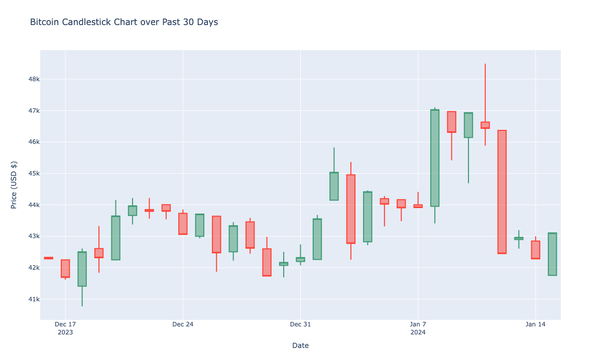

# Bitcoin Price Visualization using CoinGecko API  

**Author:** Aurel Sahiti  

---

## Project Overview
This project demonstrates a short **Python practice notebook** using the **CoinGecko API** to retrieve and visualize Bitcoin’s market price over the past 30 days.  
It uses **pandas** for data handling and **Plotly** for creating an interactive candlestick chart.  

---

## Objective
- Retrieve live cryptocurrency market data via **CoinGecko API**  
- Convert nested JSON responses into a clean **pandas DataFrame**  
- Create an interactive **candlestick chart** of Bitcoin’s price fluctuations  
- Export the visualization as an **HTML file**  

---

## Tools & Libraries
- **Python 3.11+**
- **PyCoinGecko** — for accessing the CoinGecko API  
- **Pandas** — for cleaning and structuring data  
- **Plotly** — for creating the interactive chart  

---

## Workflow

### 1. Retrieve Data
Use the CoinGecko API to request Bitcoin market data (past 30 days, USD):

```python
from pycoingecko import CoinGeckoAPI
cg = CoinGeckoAPI()

bitcoin_data = cg.get_coin_market_chart_by_id(
    id='bitcoin',
    vs_currency='usd',
    days=30
)
```

---

### 2. Transform Data into a DataFrame

```python
import pandas as pd

bitcoin_price_data = bitcoin_data['prices']
data = pd.DataFrame(bitcoin_price_data, columns=['TimeStamp', 'Price'])
data['Date'] = pd.to_datetime(data['TimeStamp'], unit='ms')

# Prepare data for candlestick grouping
candlestick_data = data.groupby(data.Date.dt.date).agg({'Price': ['min', 'max', 'first', 'last']})
```

---

### 3. Visualize Data with Plotly

```python
import plotly.graph_objects as go

fig = go.Figure(data=[go.Candlestick(
    x=candlestick_data.index,
    open=candlestick_data['Price']['first'],
    high=candlestick_data['Price']['max'],
    low=candlestick_data['Price']['min'],
    close=candlestick_data['Price']['last']
)])

fig.update_layout(
    xaxis_rangeslider_visible=False,
    xaxis_title='Date',
    yaxis_title='Price (USD $)',
    title='Bitcoin Candlestick Chart over Past 30 Days'
)
```

---

### 4. Export Visualization

```python
fig.write_html('bitcoin_candlestick_graph.html')
```

The resulting file is an interactive candlestick chart viewable in any browser.

---

## Visualization Example

<p align="center">
  
</p>

---

## Key Takeaways

Using an API-first approach, data is always up to date.

Pandas simplifies data transformation and preparation for plotting.

Plotly allows fully interactive visualization with zoom and hover functionality.

This simple workflow can be adapted to any other cryptocurrency supported by CoinGecko.

---

## Possible Extensions

Automate daily updates using a scheduler (e.g., Airflow or cron).

Add moving averages or Bollinger Bands for trend analysis.

Compare multiple coins (e.g., Ethereum vs Bitcoin).

Deploy as a Streamlit dashboard for live monitoring.

---

## Author
**Aurel Sahiti**  
Data Science Graduate Student | Exploratory Analytics & Visualization  
[LinkedIn](https://linkedin.com/in/aurelsahiti) | [GitHub](https://github.com/aurelsahiti)
